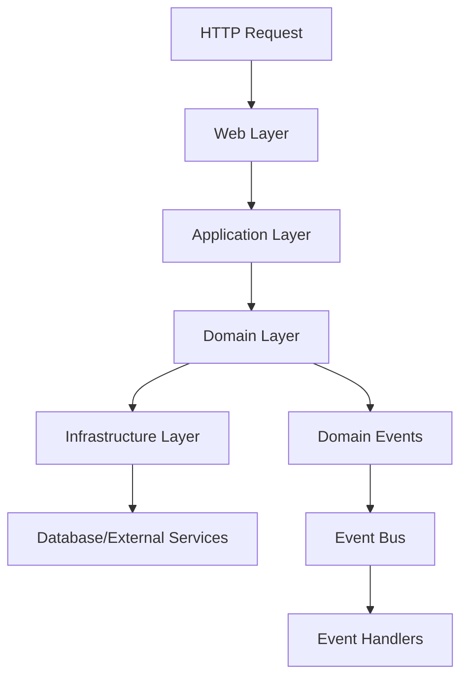

# 🏗️ Base ACL - Architecture Documentation

## Overview

This project follows a **Domain-Driven Design (DDD)** approach with **Bounded Contexts**, implementing principles from *
*Clean Architecture** and **Hexagonal Architecture** to create a scalable, maintainable, and testable enterprise-grade
application.

## 🎯 Core Principles

1. **Domain-Centric**: Business logic is the heart of the application
2. **Bounded Contexts**: Clear separation of different business domains
3. **Dependency Inversion**: Core domains don't depend on infrastructure
4. **Event-Driven**: Loose coupling through domain events
5. **CQRS Ready**: Separation of commands and queries where beneficial
6. **Test-First**: Every component is designed to be testable

## 📁 Folder Structure

```
lib/
├── base_acl_ex/
│   ├── accounts/                    # Bounded Context: User Management
│   │   ├── core/                    # Domain Layer
│   │   │   ├── entities/            # Domain Entities
│   │   │   │   └── user.ex
│   │   │   ├── value_objects/       # Value Objects
│   │   │   │   ├── email.ex
│   │   │   │   └── password.ex
│   │   │   ├── aggregates/          # Aggregate Roots
│   │   │   │   └── user_aggregate.ex
│   │   │   ├── events/              # Domain Events
│   │   │   │   ├── user_created.ex
│   │   │   │   └── user_updated.ex
│   │   │   └── ports/               # Port Interfaces
│   │   │       └── user_repository.ex
│   │   ├── application/             # Application Services
│   │   │   ├── commands/            # Command Handlers
│   │   │   │   ├── create_user.ex
│   │   │   │   └── update_user.ex
│   │   │   ├── queries/             # Query Handlers
│   │   │   │   ├── get_user.ex
│   │   │   │   └── list_users.ex
│   │   │   └── services/            # Application Services
│   │   │       └── user_service.ex
│   │   └── infrastructure/          # Infrastructure Layer
│   │       ├── adapters/            # Adapter Implementations
│   │       │   └── ecto_user_repository.ex
│   │       └── projections/         # Read Models
│   │           └── user_projection.ex
│   │
│   ├── identity/                    # Bounded Context: ACL & Authorization
│   │   ├── core/
│   │   │   ├── entities/
│   │   │   │   ├── role.ex
│   │   │   │   ├── permission.ex
│   │   │   │   └── access_control.ex
│   │   │   ├── value_objects/
│   │   │   │   ├── resource.ex
│   │   │   │   ├── action.ex
│   │   │   │   └── scope.ex
│   │   │   ├── aggregates/
│   │   │   │   └── permission_aggregate.ex
│   │   │   ├── services/            # Domain Services
│   │   │   │   ├── permission_evaluator.ex
│   │   │   │   └── role_hierarchy.ex
│   │   │   ├── events/
│   │   │   │   ├── permission_granted.ex
│   │   │   │   └── role_assigned.ex
│   │   │   └── policies/            # Business Rules
│   │   │       └── permission_policy.ex
│   │   ├── application/
│   │   │   ├── commands/
│   │   │   │   ├── grant_permission.ex
│   │   │   │   ├── revoke_permission.ex
│   │   │   │   └── assign_role.ex
│   │   │   ├── queries/
│   │   │   │   ├── check_permission.ex
│   │   │   │   └── get_user_permissions.ex
│   │   │   └── services/
│   │   │       ├── permission_cache.ex
│   │   │       └── authorization_service.ex
│   │   └── infrastructure/
│   │       ├── adapters/
│   │       │   └── ecto_permission_repository.ex
│   │       └── cache/
│   │           └── ets_permission_cache.ex
│   │
│   ├── audit/                       # Bounded Context: Audit & Compliance
│   │   ├── core/
│   │   │   ├── entities/
│   │   │   │   └── audit_log.ex
│   │   │   ├── value_objects/
│   │   │   │   └── audit_context.ex
│   │   │   └── events/
│   │   │       └── activity_logged.ex
│   │   ├── application/
│   │   │   ├── commands/
│   │   │   │   └── log_activity.ex
│   │   │   ├── queries/
│   │   │   │   └── search_audit_logs.ex
│   │   │   └── listeners/           # Event Listeners
│   │   │       └── permission_audit_listener.ex
│   │   └── infrastructure/
│   │       └── adapters/
│   │           └── ecto_audit_repository.ex
│   │
│   ├── shared_kernel/               # Shared Domain Concepts
│   │   ├── types/                   # Common Types
│   │   │   ├── uuid.ex
│   │   │   └── datetime.ex
│   │   ├── specifications/          # Specification Pattern
│   │   │   └── base_specification.ex
│   │   ├── domain_event.ex          # Base Event Module
│   │   └── aggregate_root.ex        # Base Aggregate
│   │
│   └── infrastructure/              # Cross-Cutting Infrastructure
│       ├── persistence/             # Database
│       │   ├── repo.ex
│       │   └── schemas/             # Ecto Schemas
│       ├── messaging/               # Event Bus
│       │   ├── event_bus.ex
│       │   └── event_store.ex
│       ├── cache/                   # Caching
│       │   ├── cachex_adapter.ex
│       │   └── cache_manager.ex
│       ├── security/                # Security
│       │   ├── jwt/
│       │   │   └── guardian_impl.ex
│       │   └── encryption/
│       │       └── vault.ex
│       └── telemetry/               # Observability
│           ├── metrics.ex
│           └── tracing.ex
│
├── base_acl_ex_web/                # Presentation Layer
│   ├── api/                        # API Endpoints
│   │   ├── rest/                   # REST API
│   │   │   ├── v1/
│   │   │   │   ├── auth_controller.ex
│   │   │   │   └── users_controller.ex
│   │   │   └── v2/
│   │   └── graphql/                # GraphQL API
│   │       ├── schema.ex
│   │       ├── resolvers/
│   │       └── types/
│   ├── live/                       # LiveView
│   │   ├── admin/                  # Admin Interface
│   │   │   ├── dashboard_live.ex
│   │   │   ├── users_live/
│   │   │   └── permissions_live/
│   │   └── components/             # Shared LiveView Components
│   ├── plugs/                      # HTTP Plugs
│   │   ├── authentication.ex
│   │   ├── authorization.ex
│   │   └── rate_limiter.ex
│   └── views/                      # JSON Views
│       └── api/
│
└── support/                         # Test Support
    ├── factories/
    ├── fixtures/
    └── test_helpers/
```

## 🔄 Data Flow



## 🎭 Bounded Contexts

### 1. Accounts Context

- **Responsibility**: User lifecycle management
- **Key Concepts**: User, Profile, Authentication
- **Dependencies**: None (root context)

### 2. Identity Context

- **Responsibility**: Authorization and access control
- **Key Concepts**: Role, Permission, Policy
- **Dependencies**: Accounts (for User reference)

### 3. Audit Context

- **Responsibility**: Activity tracking and compliance
- **Key Concepts**: AuditLog, Activity, Compliance
- **Dependencies**: Accounts, Identity (for context)

## 🔧 Key Patterns

### Domain Events

```elixir
defmodule BaseAclEx.SharedKernel.DomainEvent do
  @callback aggregate_id() :: String.t()
  @callback occurred_at() :: DateTime.t()
  @callback event_type() :: atom()
  @callback payload() :: map()
end
```

### Repository Pattern

```elixir
defmodule BaseAclEx.Accounts.Core.Ports.UserRepository do
  @callback find(id :: String.t()) :: {:ok, User.t()} | {:error, :not_found}
  @callback save(user :: User.t()) :: {:ok, User.t()} | {:error, term()}
  @callback delete(id :: String.t()) :: :ok | {:error, term()}
end
```

### Command/Query Separation

```elixir
# Command
defmodule BaseAclEx.Accounts.Application.Commands.CreateUser do
  use BaseAclEx.SharedKernel.Command
  
  embedded_schema do
    field :email, :string
    field :password, :string
    field :first_name, :string
    field :last_name, :string
  end
end

# Query
defmodule BaseAclEx.Accounts.Application.Queries.GetUser do
  use BaseAclEx.SharedKernel.Query
  
  embedded_schema do
    field :user_id, :string
    field :include_permissions, :boolean, default: false
  end
end
```

## 🚀 Performance Optimizations

1. **ETS-based Permission Cache**: Sub-millisecond permission checks
2. **Event Sourcing Ready**: Prepared for event sourcing implementation
3. **CQRS Support**: Separate read/write models where beneficial
4. **Connection Pooling**: Optimized database connections
5. **Async Event Processing**: Non-blocking event handlers

## 🧪 Testing Strategy

1. **Unit Tests**: Pure domain logic testing
2. **Integration Tests**: Context boundary testing
3. **Contract Tests**: Repository and adapter testing
4. **E2E Tests**: Full flow testing through API
5. **Property-Based Tests**: Invariant testing for domain rules

## 📊 Metrics & Monitoring

- **Domain Metrics**: Business-relevant metrics
- **Technical Metrics**: Performance and health metrics
- **Audit Trail**: Complete activity logging
- **Distributed Tracing**: Request flow tracking

## 🔐 Security Layers

1. **Authentication**: JWT-based with Guardian
2. **Authorization**: Policy-based with context awareness
3. **Rate Limiting**: Per-user and per-endpoint
4. **Encryption**: At-rest and in-transit
5. **Audit**: Complete activity logging

## 📚 Further Reading

- [Domain-Driven Design by Eric Evans](https://www.domainlanguage.com/ddd/)
- [Clean Architecture by Robert C. Martin](https://blog.cleancoder.com/uncle-bob/2012/08/13/the-clean-architecture.html)
- [Hexagonal Architecture by Alistair Cockburn](https://alistair.cockburn.us/hexagonal-architecture/)
- [Phoenix Contexts](https://hexdocs.pm/phoenix/contexts.html)